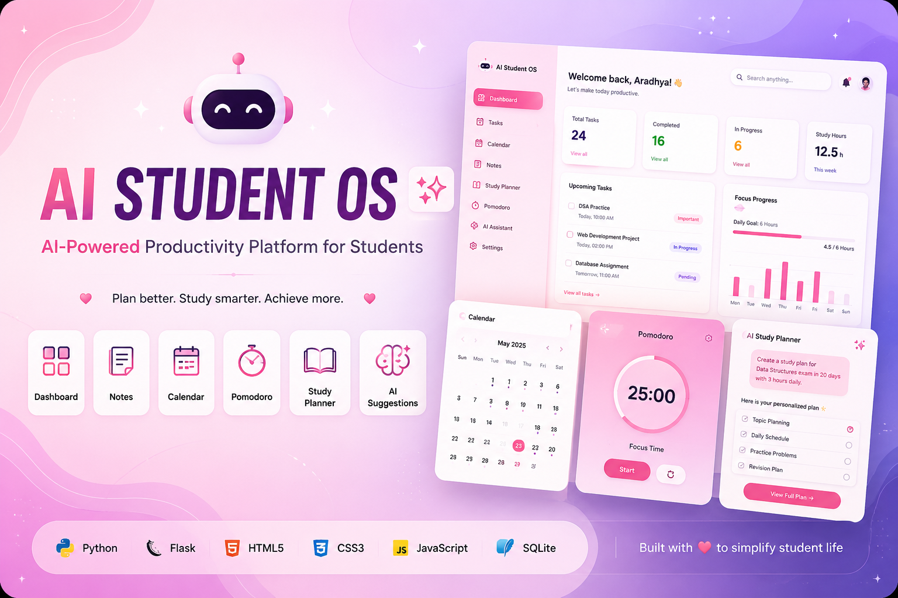

# 🤖 AI Student OS - AI powewerd study suit for students

## Badges


## Banner
<p align="center">
  
</p>

## Description

An AI-powered productivity web application built using **Flask** that helps students manage their academic life from one dashboard.

It combines task management, notes, study planning, calendar scheduling, and productivity tools into one simple application.

## 🌐 Live Demo

🚀 https://ai-student-os.onrender.com/

## 🌟 Project Highlights

- 🤖 AI-powered productivity assistant for students
- 📅 Calendar for scheduling and task organization
- 📝 Notes management
- ⏱️ Built-in Pomodoro timer
- 📚 Study planner
- 📊 Productivity dashboard
- 🎨 Responsive and clean user interface


## 💡 Why I Built This Project

As a student, I often found myself switching between multiple apps to manage tasks, notes, study sessions, and schedules. I wanted a single platform that could bring everything together while also using AI to make studying more efficient.

AI Student OS is my attempt to build that all-in-one productivity application while improving my skills in Flask, Python, JavaScript, HTML, CSS, Git, and API integration.

## 📑 Table of Contents

- [✨ Features](#-features)
- [🛠️ Tech Stack](#️-tech-stack)
- [📷 Screenshots](#-screenshots)
- [🚀 Installation](#-installation)
- [📁 Project Structure](#-project-structure)
- [🎯 Future Improvements](#-future-improvements)
- [👩‍💻 Author](#-author)

---

## ✨ Features

- 📋 Task Manager
- 🗓️ Calendar
- 📝 Notes
- ⏱️ Pomodoro Timer
- 📚 Study Planner
- 🤖 AI Study Suggestions
- 📊 Dashboard

---

## 🛠️ Tech Stack

### Backend
- Python
- Flask
- SQLite

### Frontend
- HTML5
- CSS3
- JavaScript

### AI
- Google Gemini API

### Version Control
- Git
- GitHub

---

## 📷 Screenshots

### Dashboard

Screenshots/Dashboard.png

### Calendar

Screenshots/calendar.jpg

### Notes

Screenshots/notes.jpg

### Pomodoro

Screenshots/pomodoro

### Study Tracker

Screenshots/studytracker1.jpg
Screenshots/studytracker2.jpg

### Task Manager
Screenshots/taskmanager.jpg

## 🚀 Installation

Clone the repository

```bash
git clone https://github.com/tyagiaradhya099-arch/AI-Student-OS.git
```

Move into project

```bash
cd AI-Student-OS
```

Install dependencies

```bash
pip install -r requirements.txt
```

Create a `.env` file

```
GEMINI_API_KEY=your_api_key_here
```

Run the project

```bash
python app.py
```

---

## 📁 Project Structure

```
AI-Student-OS
│
├── static/
│   ├── css/
│   ├── js/
│   └── images/
│
├── templates/
│
├── instance/
│
├── app.py
├── requirements.txt
├── .gitignore
└── README.md
```

---

## 🎯 Future Improvements

- User Authentication
- Cloud Database
- AI Chat Assistant
- Productivity Analytics
- Email Reminders
- Dark Mode
- Mobile Responsive UI

---

## 👩‍💻 Author

**Aradhya Tyagi**

GitHub:
https://github.com/tyagiaradhya099-arch

LinkedIn:
https://www.linkedin.com/in/aradhya-tyagi-70338a383
---

## ⭐ If you like this project

Give it a ⭐ on GitHub.
